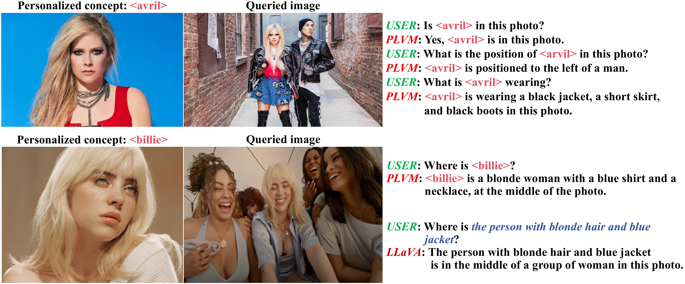

# An implementation of PLVM: Personalize Large Vision-Language Model

Paper: https://arxiv.org/pdf/2412.17610

- [ ] Training code
- [x] Inference code

**Abstract**: The personalization model has gained significant attention in image generation yet remains underexplored for large vision-language models (LVLMs).
Beyond generic ones, with personalization, LVLMs handle interactive dialogues using referential concepts (e.g, "Mike and Susan are talking.") instead of the generic form (e.g, a boy and a girl are talking.), making the conversation more customizable and referentially friendly. In addition, PLVM is equipped to continuously add new concepts during a dialogue without incurring additional costs, which significantly enhances the practicality. PLVM proposes Aligner, a pre-trained visual encoder to align referential concepts with the queried images. During the dialogues, it extracts features of reference images with these corresponding concepts and recognizes them in the queried image, enabling personalization. We note that the computational cost and parameter count of the Aligner are negligible within the entire framework. With comprehensive qualitative and quantitative analyses, we reveal the effectiveness and superiority of PLVM.

Checkpoint path: [link](https://drive.google.com/file/d/1_zdWlCXPem_RidqRW1Wt6yNe758Vovdv/view?usp=sharing)

Steps to do:
- This code is directly built on top of LLaVA. Please install [LLaVA](https://github.com/haotian-liu/LLaVA?tab=readme-ov-file#install).
- Download [YoLLaVA dataset](https://github.com/WisconsinAIVision/YoLLaVA)

Single-turn conversation:
- The single turn conversation can be done by using ``run_script.sh``.

Multi-turn conversation: Still debugging